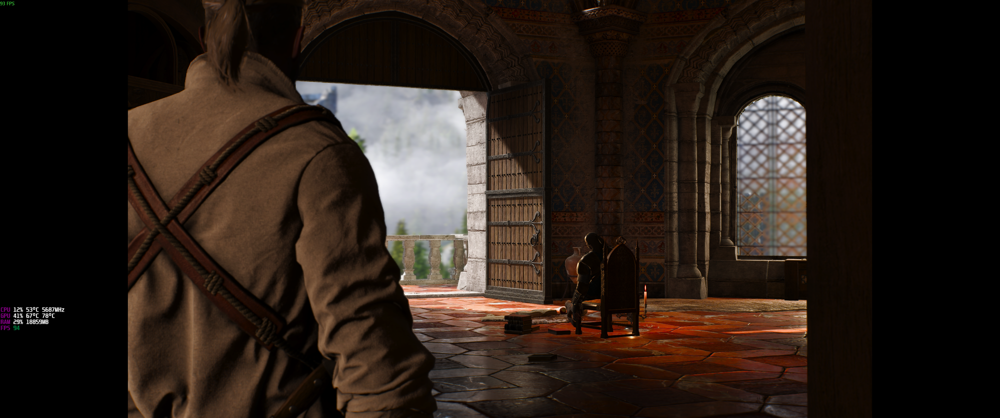
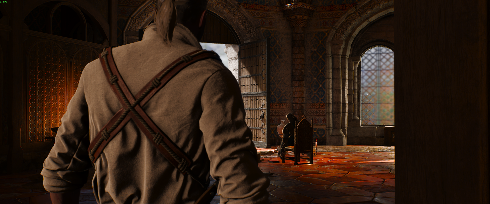

# The Witcher 3 Remastered - Ultrawide Cutscene Fix

Removes the black bars (pillarboxing) from cutscenes in **The Witcher 3: Wild Hunt - Remastered (5.x)** on ultrawide and super-ultrawide monitors.

The older NextGen (4.0x) patchers no longer work on Remastered: they either crash because the DirectX 11 executable is gone, or patch the wrong spot. This tool is built and tested against the Remastered executable.

| Before | After |
|---|---|
|  |  |

## Download

Grab `W3UltrawideFix.exe` from the [latest release](../../releases/latest) or from [Nexus Mods](https://www.nexusmods.com/witcher3/mods/13876).

## Usage

1. Close the game.
2. Run `W3UltrawideFix.exe` (it asks for administrator rights because Steam installs the game under `Program Files`).
3. The tool finds the game automatically (Steam libraries, GOG). If it can't, put the exe in the game folder or paste the path when asked.
4. Pick your resolution:
   - 2560x1080, 3440x1440, 3840x1600, 5120x2160, 6880x2880 (21:9)
   - 3840x1200 (32:10)
   - 5120x1440 (32:9)
   - or enter any custom resolution
5. Launch the game.

To change resolution, just run the tool again. To remove the fix, run it and choose **R) Restore original**, or use *Verify integrity of game files* in Steam/GOG.

Command line, for scripting:

```
W3UltrawideFix.exe --res 3440x1440
W3UltrawideFix.exe --restore
W3UltrawideFix.exe --path "D:\Games\The Witcher 3" --res 5120x1440
```

> Game updates and *Verify integrity of game files* replace `witcher3.exe` and undo the fix. Run the tool again afterwards.

## How it works

Cutscenes are letterboxed to a hard-coded 16:9 aspect ratio, stored in the executable as the 32-bit float `1.7777778` (`39 8E E3 3F`). The tool replaces **every** occurrence of that value in `bin\x64_dx12\witcher3.exe` (and `bin\x64\witcher3.exe` if present) with your monitor's aspect ratio.

Replacing only some occurrences is not enough - in 5.x patching a single value either has no effect or crashes the game on load. All of them must change together.

Before patching, the original exe is saved as `witcher3.exe.uwfix-backup`. The backup is only reused if it matches the current game build, so a stale backup from before a game update can never be restored over a newer exe.

Tested with Steam, version `5.0.0.1048522` (patch 5.01), DirectX 12, 3440x1440.

## Building

Requires the .NET SDK (8+). Targets .NET Framework 4.8, which ships with Windows 10/11, so users don't need to install anything.

```
dotnet build src/W3UltrawideFix -c Release -o out
```

## Credits

- [vulkk.com](https://vulkk.com/2021/06/27/how-to-fix-witcher-3-ultrawide-cutscenes-no-black-bars/) - original hex-edit guide
- [mrHalfer/The-Witcher-3-Ultrawide-NoBlackBars-Fix-NextGen](https://github.com/mrHalfer/The-Witcher-3-Ultrawide-NoBlackBars-Fix-NextGen) - replace-all approach and resolution presets
- [lepoco/w3.ws](https://github.com/lepoco/w3.ws) - NextGen widescreen cutscene patcher

## License

MIT
